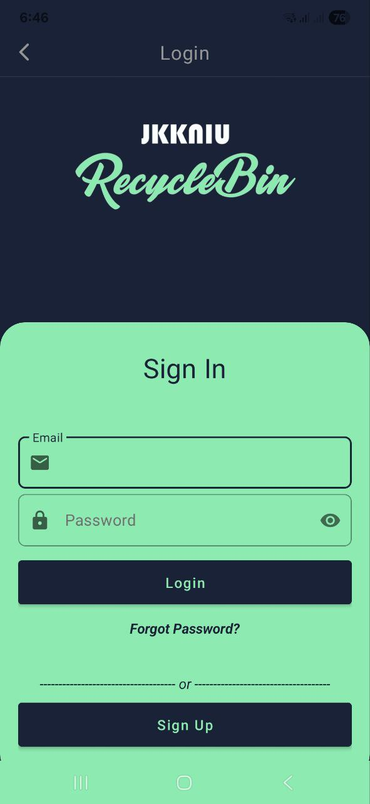
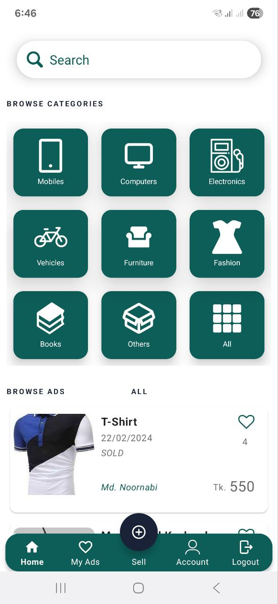
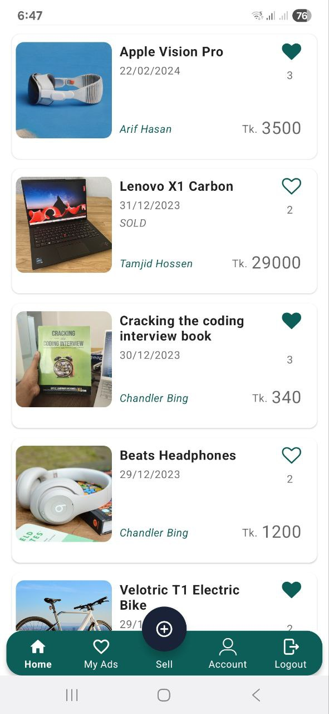
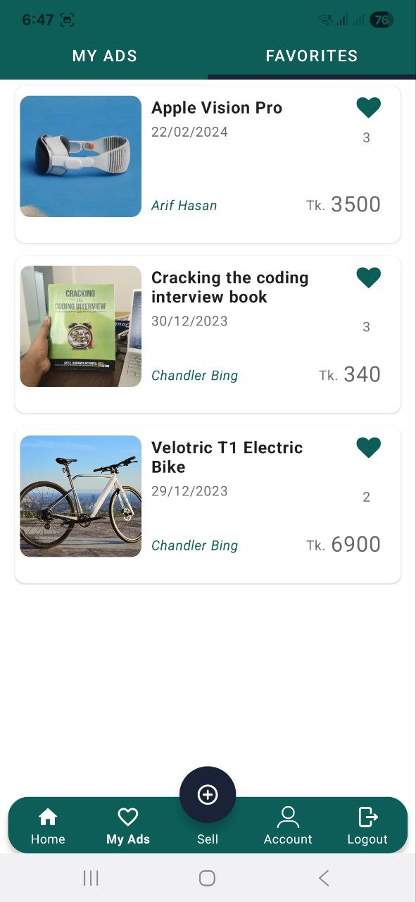
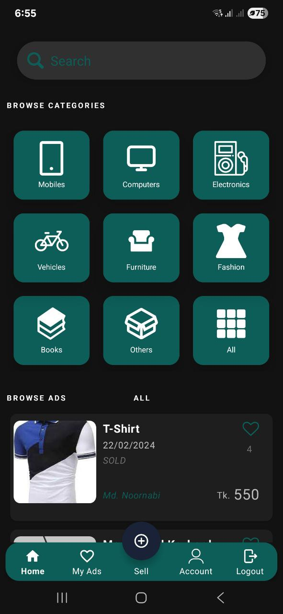
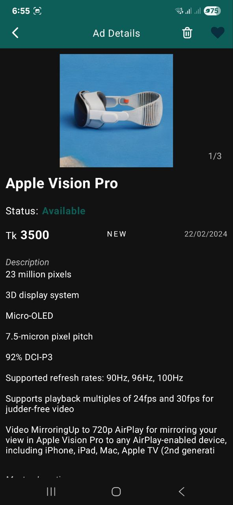

# JKKNIU Recycle Bin

A comprehensive buy-sell marketplace Android application for students of Jatiya Kabi Kazi Nazrul Islam University (JKKNIU). This mobile app enables students to buy and sell second-hand items, textbooks, electronics, and other goods within the university community, promoting sustainability through reuse.

## 🌟 Features

- **Student Registration & Login**: Secure email-based authentication with Firebase
- **Post & Browse Items**: Easy listing creation and search with categories
- **Facebook-style Likes**: Like system for items and users (no reviews)
- **Favorites**: Save items for later viewing
- **Profile Management**: Update profiles and view transaction history
- **Dark Mode**: Beautiful dark theme support
- **Material Design**: Modern Android UI with smooth animations

## 🛠️ Technology Stack

### Android Development

- **Java**: Primary programming language
- **Android Studio**: Official IDE for Android development
- **Material Design Components**: Google's design system for beautiful UI
- **View Binding**: Modern view binding for cleaner code
- **Glide**: Image loading and caching library

### Firebase Backend

- **Firebase Realtime Database**: Real-time data synchronization
- **Firebase Authentication**: Secure email-based authentication with verification
- **Firebase Storage**: Cloud storage for images and files
- **Firebase Crashlytics**: Crash reporting and analytics

### Key Features

- **Email Verification**: Firebase email verification system
- **Real-time Updates**: Instant data synchronization across devices
- **Image Handling**: Camera integration and photo uploads
- **Material Design**: Modern Android UI/UX patterns

## 🔥 Firebase Database Structure

```
jkkniu-marketplace
├── Ads/
│   └── {adId}/
│       ├── id, title, description, price
│       ├── category, condition, brand
│       ├── address, latitude, longitude
│       ├── timestamp, adOwnerName, vid
│       ├── status, favoriteCount
│       └── images/
├── Users/
│   └── {userId}/
│       ├── name, email, timestamp
│       └── profileImageUrl
└── Favorites/
    └── {userId}/
        └── {adId}: Boolean
```

## 📦 Dependencies

```gradle
// Firebase
implementation 'com.google.firebase:firebase-analytics:21.5.0'
implementation 'com.google.firebase:firebase-auth:22.3.0'
implementation 'com.google.firebase:firebase-database:20.3.0'
implementation 'com.google.firebase:firebase-storage:20.3.0'
implementation 'com.google.firebase:firebase-crashlytics:18.6.0'

// Android UI
implementation 'androidx.appcompat:appcompat:1.6.1'
implementation 'com.google.android.material:material:1.8.0'
implementation 'androidx.constraintlayout:constraintlayout:2.1.4'

// Image loading
implementation 'com.github.bumptech.glide:glide:4.16.0'
```

## 📱 Screenshots

<div style="display: flex; flex-wrap: wrap; gap: 10px;">






</div>

<div style="display: flex; flex-wrap: wrap; gap: 10px;">


</div>

<div style="display: flex; flex-wrap: wrap; gap: 10px;">





</div>

## 🚀 Installation

### Prerequisites

- Android Studio Arctic Fox or higher
- Android SDK (API level 21 or higher)
- Java 8 or higher
- Firebase project setup

### Setup

1. **Clone the repository**

   ```bash
   git clone https://github.com/yourusername/jkkniu-recycle-bin.git
   cd jkkniu-recycle-bin
   ```

2. **Open in Android Studio**

   - Open Android Studio
   - Select "Open an existing Android Studio project"
   - Navigate to the cloned repository folder

3. **Firebase Configuration**

   - Create a new Firebase project at [Firebase Console](https://console.firebase.google.com/)
   - Add your Android app to the Firebase project
   - Download `google-services.json` and place it in the `app/` directory
   - Enable Firebase Authentication (Email/Password)
   - Enable Firebase Realtime Database
   - Enable Firebase Storage
   - Set up Firebase Crashlytics

4. **Build and Run**
   - Connect an Android device or start an emulator
   - Click "Run" in Android Studio

## 🗂️ Project Structure

```
jkkniu-recycle-bin/
├── app/
│   ├── src/main/java/com/example/recyclebin/
│   │   ├── activities/           # All app activities
│   │   │   ├── MainActivity.java
│   │   │   ├── LoginEmailActivity.java
│   │   │   ├── RegisterEmailActivity.java
│   │   │   ├── AdCreateActivity.java
│   │   │   ├── AdDetailsActivity.java
│   │   │   └── ProfileEditActivity.java
│   │   ├── adapters/            # RecyclerView adapters
│   │   ├── fragments/           # App fragments
│   │   │   ├── HomeFragment.java
│   │   │   ├── ChatsFragment.java
│   │   │   ├── MyAdsFragment.java
│   │   │   └── AccountFragment.java
│   │   ├── models/              # Data models
│   │   │   ├── ModelAd.java
│   │   │   ├── ModelReport.java
│   │   │   └── ModelImageSlider.java
│   │   ├── FilterAd.java        # Ad filtering logic
│   │   ├── Utils.java           # Utility functions
│   │   └── RvListenerCategory.java
│   ├── src/main/res/            # Android resources
│   │   ├── layout/              # XML layouts
│   │   ├── drawable/            # Icons and images
│   │   ├── values/              # Colors, strings, styles
│   │   └── menu/                # Menu resources
│   ├── google-services.json     # Firebase configuration
│   └── build.gradle             # App-level build config
├── docs/
│   └── images/                  # Documentation screenshots
├── gradle/                      # Gradle wrapper files
├── build.gradle                 # Project-level build config
└── README.md                    # This file
```

## 🤝 Contributing

We welcome contributions to improve the JKKNIU Recycle Bin project! Create a PR to start.
